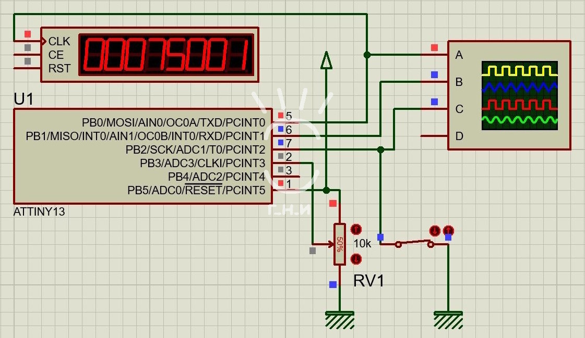

# ATtiny13. Двухканальная регулируемая ШИМ 75КГц

 

### Возможности
- Кнопка «Пуск», которая не искрит из-за высоких стартовых токов при включении
- Регулировка мощности
- Плавный пуск 1с

 

[Описание](https://dzen.ru/a/Z3fmRHsyb0QHDIKa)  
[Исходный код](main.c) 
[Прошивка](main.hex) (компиляция произведена в AVR-GCC Proteus)